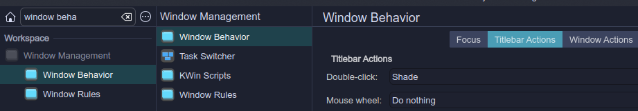

# Kmacsimize
A Kwin script to maximize windows in KDE as MacOS

# Story

Some years ago I was a owner of a MacBook Air. My first Mac product. I always use Linux 🤓 and  I never used a Mac product,
so one day I decided test it. And... I liked it some things , and  and some things didn´t like it. But in the
universe of thing that I liked it, the UX is really enjoyable, and the window managment is really cool.

But as always , the happiness is short in the life: the Mac computer stop working 😭 , so I had to return to the Linux
world, and  I miss some things of Mac world, one of them is the window managment, particullary the full maximization feature.
At that time I decided use again KDE and I always knew that KDE is really customizable so I started a Kwin script to have
the same or similar behaviour.

 

 <i> KDE , I love you ❤️. </i>

I found a project named kwin-macsimize (https://github.com/yuricbraga/kwin-macsimize/tree/master) that is a fork of another project
but kwin-macsimize didn´t work as I expected. So I took this as example and started to write the code. 
How difficult will be write this? Seems pretty simple.... Well things started to become complex and complex, and I was able to solve the problems that appeared , and after a lot of code and after a lot of checks of Kwin script documentation , I was able to created Kmacsimize. 
There are a few things that I would like to solve it but as first version I believe this is useful , and I'm really happy to were able to solve this, because when I was younger I saw the Kwin scripts as something extremely difficult, like some kind of strange magic spells that I will never be able to understand, but after a lot of work, I gained a lot to experience to be able to solve this in some weekends.
And that makes me really happy :), so I share this with you.

# Features

Kmacsimize works as I understand Mac Os window managment works or at least the features that I like it.
There are some differences that I will fix if I found them annoying in my workflow.

But the features are:

* It is possible maximize a window to a new desktop after maximize the window through the maximize button, or maximize action , like this (check that window borders
  dissapear when a window is maximized):

https://github.com/user-attachments/assets/edd11396-a957-4087-944c-757a890bf2a0

https://github.com/user-attachments/assets/9f70c888-7fe2-4729-b142-830d00a4d134

* Everytime a window that was maximized is closed in that state, the virtual desktop related with the window will be erased (in most of cases , probably there is a case that this is not possible (maybe using kill -9 or something like that))

https://github.com/user-attachments/assets/fc9e42c9-c2ed-4dee-9d79-f4f148ba5e7a

* If the window is maximized in a virtual desktop , it is possible unmaximize using escape key! (but escape button will not work in a default way in other places. I tried to solve this problem but I was not able to do it yet)

https://github.com/user-attachments/assets/959cf812-555b-4859-af79-10d7b32c03bd

* If the title bar is clicked twice the window is maximized but is not moved to a new virtual desktop (to achive this the shade window event is used)

https://github.com/user-attachments/assets/9d3b3177-3778-4ea6-92a2-bfbb59371be9

* If a window is minimized from a virtual desktop , the window will be maximized in a new virtual desktop.

https://github.com/user-attachments/assets/6d962ead-71da-4ba4-a0c7-4a7e3c03e736

# Installation

* Download the tarball and then in a terminal run `plasmapkg2 --install kmacsimize_beta.tar.gz`

* Then in KDE configuration head over to  "Kwin script" section, and then activate the KMacsimize script

 

* **IMPORTANT** : In KDE configuration head over to "Window behaviour" and then to "Title bar section". In "Titlebar actions" , In "Double-click" select "Shade". This is necessary to maximize windows in the main desktop
without moving the window to a new virtual desktop

 

* In the main.js code there is a list with windows exceptions , at this moment the exceptions are this
  `windowsExceptions=["krunner","spectacle"]`
  And this list is placed in `~/.local/share/kwin/scripts/KMacsimize/contents/code/main.js`
  If you want to add more exceptions that is the place

# Debugging

A lot of debugging messages were added in the code. By default are disabled to enable in `~/.local/share/kwin/scripts/KMacsimize/contents/code/main.js` the variable 
debug should change from false to true and relaunch the kwin script. To see the debug messages in a terminal the command `journalctl --follow` . The messages will be identify with a `KMacsimize` string

